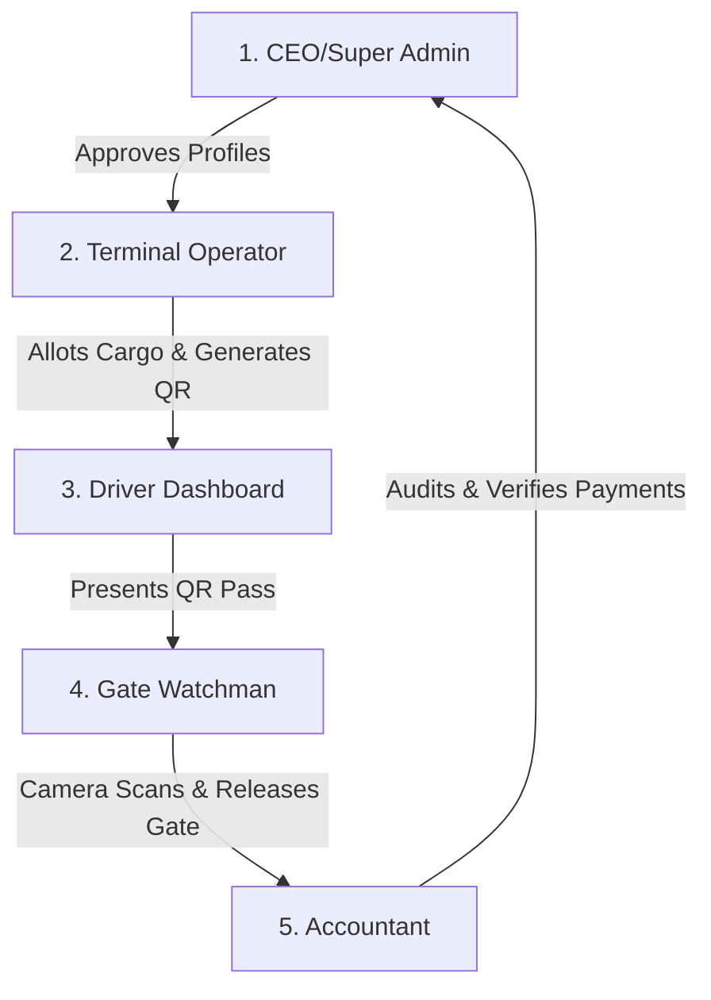

# SandTrack — Secure Anti-Fraud Gate Management & Logistics Platform

Welcome to the **SandTrack System Blueprint**. SandTrack is a state-of-the-art, role-based logistics security platform engineered to secure freight gates, prevent cargo theft, and automate terminal clearance workflows. 

This blueprint documents the system's operational architecture, currently active features, and future growth paths.

---

## 1. System Overview & Core Workflow

SandTrack digitizes the physical transit cycle of outbound cargo through a strict, multi-party cryptographic pipeline. The platform is structured around five specialized, interacting roles:



---

## 2. Completed Implementation (What is Done Now)

### 🔑 Robust User Management & Credentials
*   **CEO Admin Center:** The CEO has a unified [User Management Console](file:///c:/desktop/Rehan/Recipt%20System/frontend/src/pages/app/owner/UserManagementPage.jsx) to provision Operator, Accountant, Watchman, and Driver accounts instantly.
*   **Dynamic Staff Directory:** A unified mock database selector instantly pulls all registered staff categories, allowing real-time status toggles and secure password resets.

### 🚛 Driver & Fleet Approval Pipeline
*   **Registration Form:** Operators register new Drivers and Trucks.
*   **Secure Review Queue:** Newly registered entities enter a `Pending Approval` state, visible only to the CEO.
*   **Approval Gate:** Only after the CEO logs in and reviews/approves the driver's CNIC and the truck's fleet registry can they be selected for consignments.

### 📦 Consignment Allocation & Unique QR Passes
*   **Consignment Dispatch:** Operators assign loads to approved drivers and trucks, specifying weight (Tons), material type, and destination.
*   **Cryptographic QR Tokens:** The system generates a globally unique, secure `UUIDv4` token for each consignment.
*   **Testing Mode Expiry:** The QR code session remains stable (set to 100 years in the future) to allow seamless sandbox testing and physical scans without timeouts.

### ⏳ The Outbound Gate Clearance Protocol
*   **Initial State:** Newly generated consignments are automatically marked as `⏳ SCAN PENDING`.
*   **Driver QR Pass:** When the driver logs in, they see their active trip details and their secure QR pass.
*   **Gate Camera-Only Enforced Scan:** The Watchman's dashboard has been stripped of manual verification text inputs and [strictly defaults to the camera feed](file:///c:/desktop/Rehan/Recipt%20System/frontend/src/pages/app/watchman/ScannerPage.jsx#L210-L245). The Watchman *must* physically scan the QR code using their device's camera.
*   **Instant Outbound Transition:** The moment the Watchman scans and presses **`CLEAR GATE ✅`**, the consignment status transitions in the database to `🚛 IN TRANSIT` and the QR code is safely deactivated to prevent reuse.

### 💰 Financial Audit Trail
*   **Automatic Invoicing:** Creating a consignment triggers an automatic cash/bank payment record.
*   **Accountant Verification:** The Accountant reviews the load receipts, validates incoming payments, and audits terminal activity logs.

---

## 3. Consignment Status Lifecycle

| Status | Label | Trigger Event | Accessible Roles |
| :--- | :--- | :--- | :--- |
| `SCAN_PENDING` | **⏳ Scan Pending** | Operator registers consignment and generates QR pass. | Operator, Driver, CEO |
| `IN_TRANSIT` | **🚛 In Transit** | Watchman successfully scans the QR code and clears the gate. | Watchman, Driver, Accountant, CEO |
| `DELIVERED` | **✅ Delivered** | Receiver logs arrival at destination terminal. | Accountant, CEO |
| `FLAGGED` | **🚨 Flagged** | System detects weight discrepancies or gate bypass alerts. | CEO, Accountant |

---

## 4. Architectural Highlights & Security

> [!IMPORTANT]
> **Anti-Collision QR Tokens:** Every QR pass generates a cryptographically random UUIDv4 token with a $1$ in $5.3 \times 10^{36}$ collision chance, ensuring mathematical uniqueness.
> **Database Interceptors:** The query engine replicates complex PostgreSQL `LEFT JOIN` structures within a high-performance in-memory mock database to ensure instant execution during deployment.

---

## 5. Future Advancements

As SandTrack transitions from a sandbox terminal system to a global logistics system, the following integrations are scheduled:

### 🎥 I. Access Control Camera Integration
*   **Automatic Number Plate Recognition (ANPR):** Integrate optical character recognition (OCR) cameras at gate gantries to automatically read and match physical truck license plates against the database records, opening gates automatically.
*   **AI Face ID Verification:** Biometric facial verification cameras at the outbound gate to compare the driver’s face against their registered profile picture in real-time, preventing identity spoofing.
*   **Weighbridge API Integration:** Automatic weigh-scale synchronization to cross-reference loaded cargo weight with operator inputs, instantly flagging overloaded vehicles.

### 🤝 II. CRM & ERP Deep Integration
*   **Client Relationship Management (CRM):** A dedicated portal for shippers to order dispatches, view live delivery statuses, and download signed receipts.
*   **Unified Account Billing:** Integration with accounting packages (like QuickBooks or SAP) to automatically post driver salaries, truck fuel expenses, and customer invoices.

### 🛰️ III. Telematics & Geofencing
*   **Real-time GPS Tracking:** Embedded vehicle GPS units mapping active trips on live dashboards.
*   **Geofence Security Gate:** Automatic gate logs created the instant a vehicle crosses terminal boundaries, preventing unrecorded bypasses.

---

## 6. Executive Demonstration & Strategic Alignment Meeting

### 📅 Proposed Demonstration Details
*   **Proposed Date:** Thursday
*   **Presenter:** Mr. Danyal Tahir
*   **Meeting Focus:** Live, end-to-end walkthrough of the secure outbound logistics cycle (Operator consignment setup, driver mobile QR ticket activation, watchman camera gate-scan clearance, and accountant ledger verification), followed by a strategic review of ANPR/biometric expansion plans.

---

### ✉️ Ready-to-Copy Invitation Message

> [!TIP]
> Use the formatted message below to invite stakeholders, clients, or engineering partners to the live presentation.

```text
Subject: Live System Demonstration: SandTrack Anti-Fraud Logistics Platform

Dear Team,

We would like to cordially invite you to a live demonstration and strategic alignment meeting for the SandTrack Anti-Fraud Logistics Platform.

Our team has completed the core security infrastructure, and we are ready to show you the complete outbound transit flow in action:
1. Operator Dispatch Console (Consignment registry and approval gates)
2. Mobile Driver Dashboard (Encrypted UUIDv4 unique QR tickets)
3. Enforced Outbound Gate scanning (Watchman device camera-only scanning flow)
4. Accountant Financial Ledger (Auto-invoicing and gate release logs)

During this meeting, we will walk you through the live sandbox environment, discuss our deployment roadmap, and explore future collaboration opportunities (including OCR License Plate cameras, AI Facial Verification gates, and deep CRM/ERP integrations).

Proposed Meeting Schedule:
🗓️ Date: Thursday
👤 Host: Mr. Danyal Tahir

Please let us know your availability so we can lock in the exact calendar time slot. We look forward to showcasing this state-of-the-art terminal gate security platform to you!

Best regards,

Mr. Danyal Tahir
Director of Operations, SandTrack
```

